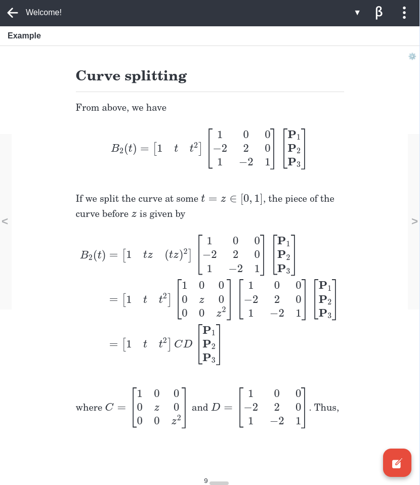

# Extra Markdown viewer settings

This plugin provides several new settings for [Joplin](https://joplinapp.org/)'s Markdown viewer.

## Screenshot

	

This screenshot shows a note in paginated mode. Extra markdown viewer settings provides buttons for navigating between pages and a jump to page input at the bottom of the screen. Paginated mode can be enabled or disabled using the gear icon at the top right of the screen.

## Platform support

This plugin supports both Joplin mobile and desktop. On mobile, it may be necessary to restart Joplin after installng the plugin for settings to be correctly applied.

## Summary of available settings

- **Paginate**: Breaks notes into pages, saves and restores the last open page.
	- **Default value**: Enabled on mobile, disabled on desktop.
	- **Known issue(s)**:
		- **Desktop**: When enabled, the note viewer's scroll position does not sync with the note editor.
		- **Desktop and mobile**: Rapidly changing viewer settings or window size may cause the reading location to be lost.
- **Viewer font family**: Sets the font family for just the Markdown viewer.
- **Viewer font size**: Sets the font size for just the Markdown viewer. If zero, the default font size will be used.
- **Viewer maximum width**: Sets the maximum content width in the Markdown viewer.

## Changing settings

Most settings can be changed by clicking on the gear icon at the top right of Joplin's Markdown viewer:

This opens a settings dialog:

Other settings can only be changed from Joplin's configuration screen.
